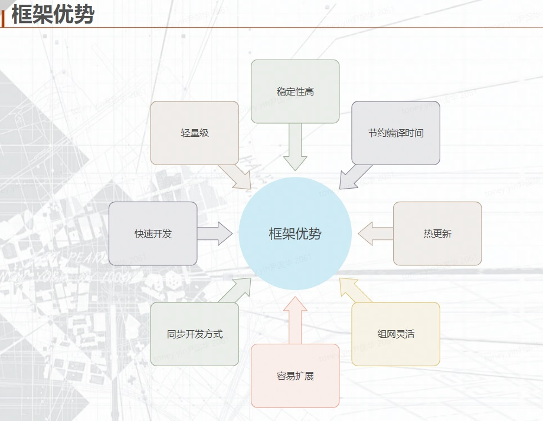
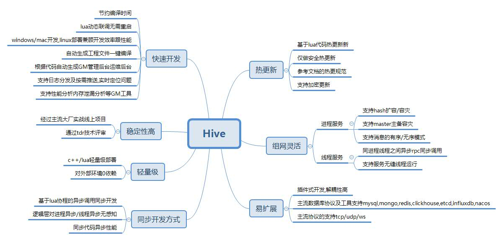
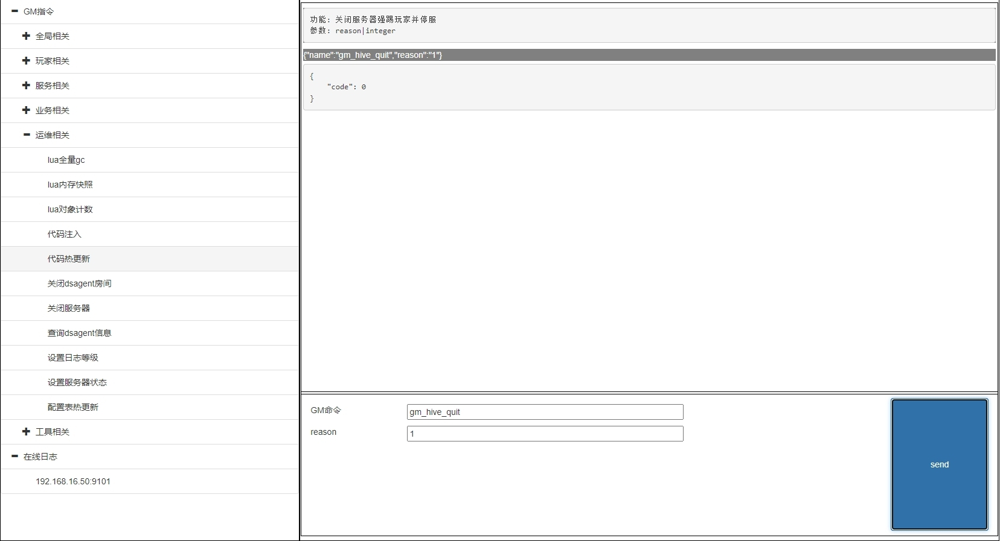
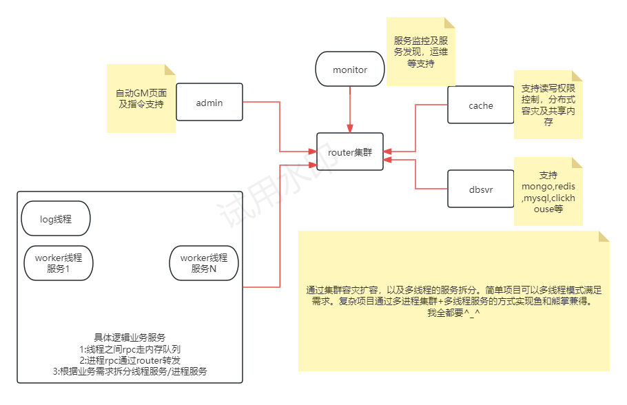

# hive
Distributed game server framework based on CPP 17 && LUA 5.4

* 框架(hive)+基础服务(server)
* 支持跨平台开发(windows,linux)
* oop模式的lua开发,支持lua热更新
* 支持星型组网及多级组网自动路由,router热备,独立子网,服务动态扩容及热备
* 基于tcp协议及lua协程实现同步代码异步rpc
* 基于行为树的机器人/单元测试一体化
* 自带GM命令快速验证
* 路由协议支持有序及无序模式,支持服务的动态扩容/容灾/hash扩容
* 支持服务线程模式(不接入集群,所有线程服务间可以相互rpc,master线程可以访问集群rpc)
* 支持nacos或monitor服务发现

## 数据库
  - mysql,clickhouse,mongodb,redis,etcd,influxdb,lmdb
  - 自实现的分布式cache服务,支持分布式读写权限控制,容灾,扩容
  
## 网络协议
  - 支持tcp,udp,websocket协议
  - 支持http client,http server及ssl模式
  - 客户端协议支持protobuf,json

## 工具
  - lmake 根据配置自动生成跨平台的makefile文件及vs.sln工程文件及一键编译
  - excel2lua 表格配置xls导出lua读写及热更
  - encrypt lua加密

## 日志
  - 分级文件日志
  - graylog日志系统
  - zipkin opentrace 分布式链路追踪
  - 飞书,钉钉,企业微信消息及错误日志推送

## 服务监控
  - Influxdb + granfana 性能监控及分析(协议,消息,rpc,cpu,内存,协程,服务等)
  - monitor监控服务
  - 自带自适应的GM web页面
  - 自带函数性能分析prof,支持协程模式

## 性能
  - rpc单服务性能在5w次/s左右,这是计算完整的从发起到接收结果.涉及到服务的拆分,部署按这个性能去做评估
  - mongodb的性能集群模式远超mysql,单机测试插入5-8w/s
  
## Documents
  - [在线文档](https://github.com/hero1s/hive/wiki)
  - [工程示例](https://github.com/hero1s/hive_demo)
  
## 

## 

## 

## 

## 有bug或好的建议请@ QQ群:543833695 Toney

## Friend Open Source
  - quanta: https://github.com/xiyoo0812/quanta
  - moon: https://github.com/sniper00/moon

## 特别贡献者
  - xiyoo0812

## todo list 
  - 目前应用于已上线百万pcu大型实时在线FPS项目,压测过5000台服务器的百万在线全区全服,同步更新优化(部分功能会延迟或简化).多多关注,建议,star
  - 相互交流&学习&借鉴(个人QQ:8242117)
  - 完善文档及工具链,编写demo
  - 优化性能,扩展功能

## 特别声明
  - 框架仅供学习交流,请勿用于商业用途
