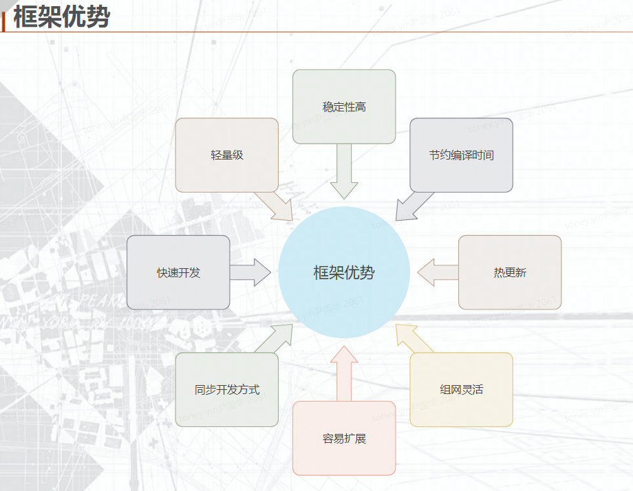

# hive
基于cpp 17 && lua 5.4 实现的分布式游戏服务器框架

* 框架(hive)+逻辑(server)
* 支持跨平台开发(windows,linux,mac)
* oop模式的lua开发,支持lua热更新
* protobuf协议
    - pbc修改了浮点数自动转整数的逻辑
* 支持星型组网及多级组网自动路由,router热备,独立子网,服务动态扩容及热备
* 基于tcp协议及lua协程实现同步代码异步rpc
* 基于行为树的机器人/单元测试一体化
* GM命令快速验证
* 路由协议支持有序及无序模式,支持服务的动态扩容容灾及hash扩容

## 数据库
  - mysql,mongodb,redis,etcd,influxdb
  - 自实现的分布式cache服务,支持分布式读写分离,容灾,扩容
  - 基于nacos配置文件的更新及服务发现
  
## 网络协议
  - 支持tcp,udp,kcp,websocket协议
  - 支持http client,http server及ssl模式
  - 客户端协议支持protobuf,json

## 工具
  - lmake 根据配置自动生成跨平台的makefile文件及vs.sln工程文件及一键编译
  - excel2lua 表格配置xls导出lua读写及热更
  - encrypt lua加密

## 日志
  - 分级文件日志
  - graylog日志系统
  - zipkin opentrace 分布式链路追踪
  - 飞书,钉钉,企业微信消息及错误日志推送

## 服务监控
  - Influxdb + granfana 性能监控及分析(协议,消息,rpc,cpu,内存,协程,服务等)
  - monitor监控服务
  - 自带自适应的GM web页面
  - 自带函数性能分析prof

## 性能
  - rpc单服务性能在4.5w次/s左右,这是计算完整的从发起到接收结果.涉及到服务的拆分,部署按这个性能去做评估
  - mongodb的性能集群模式远超mysql,单机测试插入5-8w/s

## 目录简介

- [hive] ：hive框架
  - [bin] ：框架可执行文件
  - [core] ：框架c++代码
  - [extend] ：扩展库c++工程
  - [script] ：框架lua代码
  - [doc] : 使用文档说明
  - [deploy] : 服务相关的配置表
  - [server] ：框架服务
    - [admin] : 后台管理及自动生成的GM页面
    - [cache] : 游戏数据缓存服务目前仅支持mongo
    - [monitor] : 监控服务及实时日志页面查看
    - [online] : 玩家在线服用于消息转发
    - [proxy] : http 请求代理服
    - [qtest] : 测试代码样例
    - [router] : 消息路由服,负责消息及rpc转发.目前单层星型,后续支持多层子网模式
  - [tools] ：框架工具
    - [encrypt] : lua源码加密
    - [lmake] : 自动生成makefile 及 vs工程
    - [excel2lua] : 转表工具
  - [proto] : proto协议
  - create_lmake.bat 用于生成所有c++工程
  
## 

## 有bug或好的建议请@ QQ:8242117 Toney

## todo list 
  - c++ gateway服务
  - 分级路由组网,支持百万pcu
  - 现有部分特殊服务的固定hash,改进成切片模式,无缝扩容,容灾
  - nacos服务注册与发现及配置更新
  - 完善文档及工具链